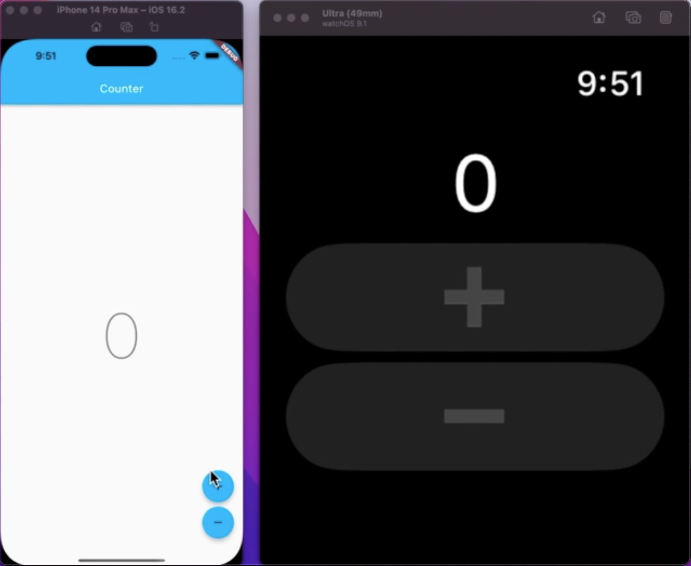

# Flutter + Apple Watch Counter App

### Integrates the default counter app with Apple WatchOS using [Platform Channels](https://docs.flutter.dev/development/platform-integration/platform-channels) via the [MethodChannel class](https://api.flutter.dev/flutter/services/MethodChannel-class.html).

<p align="center">
<a href="[media/flutter_watch.mov](https://youtu.be/zrEz-HGwGL4)">
</p></a>

<p align="center">

</p>

## Flutter

### view/counter_page.dart

Set up the communication channel.

```dart
final MethodChannel _channel = const MethodChannel('flutter_watch');
```

Handle interactions from Apple Watch button taps.

```dart
class \_CounterViewState extends State<CounterView> {
@override
void initState() {
super.initState();

    widget.channel.setMethodCallHandler((call) async {
      final methodName = call.method;
      final args = call.arguments;
      if (methodName != 'updateFromWatch') {
        return;
      }
      // ignore: avoid_dynamic_calls
      final text = args['text'] as String;
      if (text == 'increment') {
        context.read<CounterCubit>().increment();
      } else if (text == 'decrement') {
        context.read<CounterCubit>().decrement();
      }
    });

}
```

### cubit/counter_cubit.dart

```dart
void _sendToWatch(String text) {
    channel?.invokeMethod('sendToWatch', {
      'method': kRemoteMethod,
      'data': {
        'text': text,
      },
    });
  }
```

## IOS

### AppDelegate.swift

```swift
  private var channel: FlutterMethodChannel?
```

```swift
override func application(
        _ application: UIApplication,
        didFinishLaunchingWithOptions launchOptions: [UIApplication.LaunchOptionsKey: Any]?
    ) -> Bool {
      ...
        initWatchConnectivity()
        initFlutterChannel()
        ...
    }
```

```swift
 private func initWatchConnectivity() {
        guard WCSession.isSupported() else { return }
        session = WCSession.default
        session?.delegate = self
        session?.activate()
    }
```

```swift
 private func initFlutterChannel() {
        DispatchQueue.main.async {
            let remoteMethod = "sendToWatch";
            guard let controller = self.window?.rootViewController as? FlutterViewController else { return }

            let channel = FlutterMethodChannel(name: "flutter_watch", binaryMessenger: controller.binaryMessenger)
            channel.setMethodCallHandler { [weak self] call, result in
                let method = call.method
                let args = call.arguments

                guard method == remoteMethod else { return }
                guard let watchSession = self?.session, watchSession.isPaired, let messageData = args as? [String: Any] else {
                    print("Apple watch not connected.")
                    return
                }

                guard watchSession.isReachable else {
                    print("Apple watch not available.")
                    return
                }

                watchSession.sendMessage(messageData, replyHandler: nil, errorHandler: nil)
            }
            self.channel = channel
        }
    }
```

### WatchCommunicationManager.swift

```swift
final class WatchCommunicationManager: NSObject, ObservableObject {
    @Published var text: String?

    private let session: WCSession

    init(session: WCSession = .default) {
        self.session = session
        super.init()
        self.session.delegate = self
        self.session.activate()
    }

    func updateText(_ text: String) {
        session.sendMessage(["method": "updateFromWatch", "data": ["text": text]], replyHandler: nil, errorHandler: nil)
        self.text = text
    }
}
```

```swift
extension WatchCommunicationManager: WCSessionDelegate {
    func session(_ session: WCSession, activationDidCompleteWith activationState: WCSessionActivationState, error: Error?) { }
    func session(_ session: WCSession, didReceiveMessage message: [String : Any]) {
        guard let method = message["method"] as? String, let data = message["data"] as? [String: Any] else { return }

        guard method == "updateFromApp", let text = data["text"] as? String else { return }

        Task { @MainActor in
            self.text = text
        }
    }
}
```
